# Исследование архитектурного решения

Для выполнения дальнейшей работы были применены теоретические сведения из "Руководства Microsoft по моделированию приложений".

## Проектирование архитектуры

На этапе проектирования архитектуры важным является выполнение следующих этапов:
- [Определить тип приложения](#1-определение-типа-приложения);
- [Выбрать стратегию развертывания](#2-выбор-стратегии-развертывания);
- [Обосновать выбор технологии](#3-обоснование-выбора-технологии);
- [Указать показатели качества](#4-показатели-качества);
- [Обозначить пути реализации сковзной функциональности](#5-пути-реализации-сковзной-функциональности).

По завершении вышеизложенных этапов изобразить структурную схему приложения в виде функциональных блоков. Выделить слои функциональности и связи.
Ознакомится с каждым этапом можно перейдя по ссылке(названию этапа).
Ниже приведена структурная схема приложения в виде простой структурной схемы-диаграммы UML(компонентов) To be:
")

## 1 Определение типа приложения

Исходя из архетипов приложений в качестве типа для фоторедактора был выбран тип "Насыщенное клиентское приложение". Такие приложения обычно разрабатываются как самодостаточные приложения с графическим пользовательским интерфейсом, обеспечивающим отображение данных с помощью набора элементов управления.
Разрабатываемое приложение не нуждается в постоянном или переменном подключении, запускается на ПК пользователя.
Перечислим преимущества и недостатки выбранного типа приложения:

| Преимущества | Недостатки | 
|-------------|-------------|
| Возможность использования ресурсов клиента| Сложность развертывания; при этом широкий выбор вариантов установки, таких как ClickOnce, Windows Installer и XCOPY|
| Лучшее время отклика, насыщенная функциональность UI и улучшенное взаимодействие с пользователем|Сложности обеспечения совместимости версий|
|Очень динамичное взаимодействие с коротким временем отклика|Зависимость от платформы| 
Поддержка сценариев без подключения и сценариев без постоянного подключения|| 

Данная таблица лишний раз подчеркивает, что все преимущества данного подхода являются обязательными компонентам разрабатываемого приложения.
Как правило, насыщенное клиентское приложение структурировано как многослойное приложение, включающее слой пользовательского интерфейса(представления), бизнес-слой и слой доступа к данным.   
{ align=center }

## 2 Выбор стратегии развертывания

При выработке стратегии развертывания, прежде всего, необходимо определиться, какая модель развертывания будет использоваться: распределенное или нераспределенное развертывание. Исходя из типа приложения и полного отсутсвия сетевой части целесообразным было выбрано распределенное развертывание.
При распределенном развертывании все слои приложения располагаются на разных физических уровнях. Для разрабатываемого приложения лучше всех подходит шаблон распределенного развертывания "3-уровневое развертывание".   

## 3 Обоснование выбора технологии

Ключевым фактором при выборе технологий для приложения является тип разрабатываемого приложения, а также предпочтительные варианты топологии развертывания приложения и архитектурные стили.
Несмотря на то, что в рекомендациях Microsoft указаны технологии Windows Forms и WPF, для разрабатываемого фоторедактора выбрана кроссплатформенная библиотека Qt по следующим причинам:
1. **Специфика предметной области**. Qt предоставляет богатые возможности для работы с графикой через модуль Qt GUI и оптимизированные классы QImage QPixmap, что критически важно для приложения-фоторедактора.
2. **Производительность**. Qt компилируется в нативный код, обеспечивая максимальную производительность при обработке изображений. Это особенно важно для операций с большими файлами и сложными фильтрами.
3. **Гибкость архитектуры**. Qt поддерживает все необходимые паттерны проектирования (MVC, MVP) и позволяет четко разделить уровни приложения согласно выбранной 3-уровневой архитектуре:
    3.1 Уровень представления: Qt Widgets/QML
    3.2 Бизнес-логика: C++ классы с использованием Qt-контейнеров
    3.3 Уровень данных: Qt файловые операции и QSettings
Выбор Qt оставляет возможность для будущего расширения функционала, включая потенциальный перенос на другие платформы или добавление сетевых возможностей без смены технологического стека.

## 4 Показатели качества

Показатели качества, такие как безопасность, производительность, удобство и простота использования, помогают сфокусировать внимание на критически важных проблемах, которые  должен решать создаваемый дизайн.
Исходя из специфики разрабатываемого приложения — фоторедактора с насыщенным клиентским интерфейсом и полной автономностью — определены следующие ключевые показатели качества:
1. **Производительность** - скорость применения фильтров и эффектов, отзывчивость интерфейса при работе с большими изображениями
2. **Надежность** - стабильная работа без потери данных, корректное автосохранение, обработка нештатных ситуаций
3. **Удобство и простота использования** - интуитивный интерфейс, доступность инструментов, соответствие ожиданиям пользователей
4. **Удобство и простота обслуживания** - модульная архитектура для легкого добавления новых фильтров и форматов
5. **Тестируемость** - возможность автоматического тестирования отдельных компонентов обработки изображений
6. **Безопасность** - защита от повреждения исходных файлов, безопасная работа с временными файлами
7. **Концептуальная целостность** - единый подход к реализации инструментов и фильтров, согласованность API

Для данного приложения можно исключить:
1. **Возможность взаимодействия** - приложение офлайн, не требует обмена данными с внешними системами
2. **Масштабируемость** - нагрузка фиксированная (один пользователь, локальный компьютер)
3. **Управляемость** - нет задач системного администрирования

## 5 Пути реализации сковзной функциональности

Сквозная функциональность (cross-cutting concerns) представляет ключевую область дизайна, не связанную с конкретной бизнес-логикой, но необходимую для обеспечения требуемых показателей качества приложения.

Для разрабатываемого фоторедактора к сквозному функционалу относятся:

- **Кэширование** - оптимизация производительности при работе с изображениями и параметрами инструментов;
- **Управление исключениями** - централизованная обработка ошибок на всех уровнях приложения;
- **Протоколирование (логирование)** - запись событий для диагностики и анализа работы.

Каждый из перечисленных функциональных аспектов реализован в виде специализированных классов, обеспечивающих единообразный мониторинг состояния объектов. Кэширование применяется как к промежуточным результатам обработки изображений, так и к часто используемым параметрам инструментов, что позволяет минимизировать повторные вычисления. Управление исключениями реализовано через централизованный механизм, перехватывающий ошибки на всех уровнях архитектуры и обеспечивающий корректное восстановление состояния приложения.

Для протоколирования используется аспектно-ориентированный подход (АОП), реализованный на основе множественного наследования, поддерживаемого в C++. Это позволяет отделить код логирования от основной бизнес-логики, инкапсулировать сквозную функциональность в отдельных классах-аспектах и динамически применять ее к требуемым компонентам системы без дублирования кода.

# As is
Диаграмма классов As is без учета наслоедования от Qt классов:

```mermaid
classDiagram
    class Action {
        -size_t m_cache
        +Action()
    }

    class Canvas {
        -vector~Layer*~ m_layers
        -QGraphicsScene* m_parent_sceene
        -Layer* m_selected
        -int m_selected_index
        +Canvas(QObject* parent)
        +addLayer(Layer* layer)
        +newLayer()
        +draw(QPainter* painter)
        +deleteLayer(int id)
        +renderCanvas()
        +setScene(QGraphicsScene* scene)
        +moveLayer(int id, int shift)
        +selectLayer(int id)
        +getSelectedLayerid() int
        +addObjectToSelectedLayer(Object* obj)
        +getLayersInfo() vector~LayerInfo~
    }

    class ContextPannel {
        -QHBoxLayout* m_context_pannel_layout
        +ContextPannel(QWidget* parent)
        +getLayout() const QHBoxLayout&
    }

    class FileManager {
        +FileManager(QWidget* parent)
        +openFile() bool
        +createFile() bool
        +saveFile() bool
        +saveAsFile() bool
        +printFile() bool
        +closeFile() bool
    }

    class InfoPannel {
        -pair~int,int~ m_canvas_size
        -QPushButton* m_btn_decrease
        -QPushButton* m_btn_increase
        -QLineEdit* m_scale_edit
        -QLabel* m_scale_label
        -QLabel* m_canvas_size_label
        -QHBoxLayout* m_info_pannel_layout
        -float m_scale
        +InfoPannel(pair~int,int~ canvas_size, float scale, QWidget* parent)
        +setScale(float scale)
        +setCanvasSize(pair~int,int~ canvas_size)
        +updateCanvasSizeDisplay(int width, int height)
        +updateScaleDisplay(float scale)
        +getLayout() const QHBoxLayout&
        +updateDisplay()
    }

    class InstrumentPannel {
        -QVBoxLayout* m_instrument_pannel_layout
        -vector~QPushButton*~ m_bttns_instruments
        -unordered_map~InstrumentType,pair~QIcon,QString~~ m_instrument_icon
        +InstrumentPannel(QWidget* parent)
        +getLayout() const QVBoxLayout&
        -createButtonsArray(QWidget* parent)
        -fillInstumentIcon()
        -setButtonsIcons()
        -addInsruments()
    }

    class Layer {
        -bool m_visible
        -bool m_locked
        -QString m_name
        -vector~Object*~ m_objects
        +Layer(QObject* parent)
        +Layer(const QString& name, QObject* parent)
        +draw(QPainter* painter)
        +addObject(Object* object)
        +setName(const QString& name)
        +getName() QString
        +setVisible(bool vissible)
        +isVisible() bool
        +setLocked(bool locked)
        +isLosked() bool
        +getInfo() LayerInfo
    }

    class LayerWidget {
        -QHBoxLayout* m_layout
        -QPushButton* m_lock_btn
        -QPushButton* m_eye_btn
        -QPushButton* m_up_btn
        -QPushButton* m_down_btn
        -QPushButton* m_delete_btn
        -QLabel* m_layer_name
        -int m_index
        -bool m_is_selected
        +LayerWidget(QWidget* parent)
        +setName(const QString& name)
        +setIndex(int id)
        +getIndex() int
        +setSelected(bool selected)
        +isSelected() bool
        +paintEvent(QPaintEvent* event)
        +mousePressEvent(QMouseEvent* event)
        -onDeleteClicked()
        -onUpClicked()
        -onDownClicked()
    }

    class LayersPannel {
        -QPushButton* m_new_layer_btn
        -Canvas* m_canvas_ptr
        -QVBoxLayout* m_main_layout
        -QVBoxLayout* m_layers_layout
        -vector~LayerWidget*~ m_layers
        +LayersPannel(QWidget* parent, Canvas* canvas)
        -updateLayers()
        -moveLayer(int id, int shift)
        -refreshSelectionVisuals(int selectedIndex)
        -onLayerDeleteClicked()
        -onNewLayerClicked()
        -onLayerUpClicked()
        -onLayerDownClicked()
        -onLayerClicked()
    }

    class MainWindow {
        -QGraphicsScene* m_scene_main
        -QGraphicsView* m_view_main
        -InfoPannel* m_info_pannel_layout
        -ContextPannel* m_context_pannel_layout
        -InstrumentPannel* m_instrument_pannel_layout
        -LayersPannel* m_layers_pannel
        -PalettePannel* m_palette_pannel_layout
        -ProjectManager* m_project_manager
        -Ui::MainWindow* ui
        +MainWindow(QWidget* parent)
        +eventFilter(QObject* obj, QEvent* event) bool
        +resizeEvent(QResizeEvent* event)
        -createMenuBar()
        -openFile()
        -updateInfoPanel()
    }

    class Object {
        #QPointF m_position
        #float m_rotation
        #float m_scale
        #bool m_visible
        +Object(QObject* parent)
        +draw(QPainter* painter)*
        +contains(const QPointF& point)* bool
        +boundingRect()* QRectF
        +setPosition(const QPointF& pos)
        +position() QPointF
        +setRotation(float angle)
        +getRotation() float
        +setScale(float scale)
        +getScale() float
        +setVisible(bool visible)
        +isVisible() bool
        +move(const QPointF& delta)
        +rotate(float angle)
        +scaleBy(float factor)
    }

    class StyleObject {
        #QColor m_fillColor
        #QColor m_strokeColor
        #float m_strokeWidth
        #float m_opacity
        +StyleObject(QObject* parent)
        +setFillColor(const QColor& color)
        +fillColor() QColor
        +setStrokeColor(const QColor& color)
        +getStrokeColor() QColor
        +setStrokeWidth(float width)
        +getStrokeWidth() float
        +setOpacity(float opacity)
        +getOpacity() float
    }
    StyleObject --|> Object

    class Shape {
        #bool m_filled
        +Shape(QObject* parent)
        +setFilled(bool filled)
        +isFilled() bool
    }
    Shape --|> StyleObject

    class Ellipse {
        -QPointF m_center
        -qreal m_radius
        +Ellipse(const QPointF& center, qreal radius, QObject* parent)
        +Ellipse(qreal x, qreal y, qreal radius, QObject* parent)
        +Ellipse(QObject* parent)
        +draw(QPainter* painter)
        +contains(const QPointF& point) bool
        +boundingRect() QRectF
        +setCenter(const QPointF& center)
        +getCenter() QPointF
        +setRadius(qreal radius)
        +getRadius() qreal
    }
    Ellipse --|> Shape

    class Rectangle {
        -QRectF m_rect
        -qreal m_cornerRadius
        +Rectangle(const QRectF& rect, QObject* parent)
        +Rectangle(qreal x, qreal y, qreal width, qreal height, QObject* parent)
        +draw(QPainter* painter)
        +contains(const QPointF& point) bool
        +boundingRect() QRectF
        +setRect(const QRectF& rect)
        +getRect() QRectF
        +setSize(const QSizeF& size)
        +getSize() QSizeF
        +setCornerRadius(qreal radius)
        +getCornerRadius() qreal
    }
    Rectangle --|> Shape

    class Text {
        -QString m_text
        -QFont m_font
        -Qt::Alignment m_alignment
        +Text(const QString& text, QObject* parent)
        +draw(QPainter* painter)
        +contains(const QPointF& point) bool
        +boundingRect() QRectF
        +setText(const QString& text)
        +getText() QString
        +setFont(const QFont& font)
        +getFont() QFont
        +setAlignment(Qt::Alignment alignment)
        +getAlignment() Qt::Alignment
    }
    Text --|> StyleObject

    class Line {
        -QPointF m_start
        -QPointF m_end
        +Line(const QPointF& start, const QPointF& end, QObject* parent)
        +draw(QPainter* painter)
        +contains(const QPointF& point) bool
        +boundingRect() QRectF
        +setStartPoint(const QPointF& point)
        +getStartPoint() QPointF
        +setEndPoint(const QPointF& point)
        +getEndPoint() QPointF
        +setLine(const QPointF& start, const QPointF& end)
    }
    Line --|> StyleObject

    class PalettePannel {
        -int m_current_hue
        -QImage m_color_palette
        +PalettePannel(QWidget* parent)
        +setHue(int hue)
        +paintEvent(QPaintEvent* event)
        +resizeEvent(QResizeEvent* event)
        -updateColorImage()
    }

    class Project {
        -Canvas* m_canvas
        +Project()
        +GetCanvas() Canvas*
    }

    class ProjectManager {
        -vector~Project*~ m_projects
        -Project* m_selected_project
        -FileManager* m_file_manager
        +ProjectManager(QWidget* parent)
        +GetCurrentCanvas() Canvas*
        +createProject()
        +openFile() bool
        +createFile() bool
        +saveFile() bool
        +saveAsFile() bool
        +printFile() bool
        +closeFile() bool
    }

    class Tool {
        +Tool()
        +actOnSelectedArea(Canvas* canvas, ToolActArg arg)*
    }

    class FigureTool {
        +FigureTool()
        +actOnSelectedArea(Canvas* canvas, ToolActArg arg)
    }
    FigureTool --|> Tool

    %% Relationships with orthogonal lines using explicit links
    Canvas "1" --> "*" Layer : contains
    Canvas --> Layer : selected
    Canvas --> Object : adds to selected layer
    
    Layer "1" --> "*" Object : contains
    
    LayersPannel --> Canvas : manages
    LayersPannel --> LayerWidget : creates
    
    Project "1" --> "1" Canvas : has
    
    ProjectManager "1" --> "*" Project : manages
    ProjectManager --> FileManager : uses
    
    MainWindow --> InfoPannel
    MainWindow --> ContextPannel
    MainWindow --> InstrumentPannel
    MainWindow --> LayersPannel
    MainWindow --> PalettePannel
    MainWindow --> ProjectManager
    MainWindow --> Canvas
    
    FigureTool ..|> Tool : implements
    FigureTool --> Canvas : acts on
```

## Сравнение архитектур AS IS и TO BE

### Уровень детализации: диаграмма компонентов

#### Отличие 1: Обработка сквозной функциональности
- **AS IS**: Логирование, обработка исключений и кэширование встроены непосредственно в классы (если реализованы)
- **TO BE**: Выделены в отдельные аспекты с использованием АОП через множественное наследование
- **Причина изменения**: Уменьшение связанности, повышение переиспользуемости

#### Отличие 2: Управление инструментами
- **AS IS**: Прямое создание инструментов в InstrumentPannel
- **TO BE**: Внедрение зависимостей через DI-контейнер
- **Причина**: Улучшение тестируемости, возможность замены инструментов

#### Отличие 3: Работа с кэшем
- **AS IS**: Не реализована (только задел в классе Action)
- **TO BE**: Выделенный класс ImageCache с политиками вытеснения
- **Причина**: Повышение производительности при работе с изображениями

### Принципы проектирования, примененные при рефакторинге:

1. **Single Responsibility Principle**:
   - Выделение логирования в отдельный аспект
   - Создание отдельного класса для кэширования

2. **Dependency Inversion Principle**:
   - Внедрение зависимостей через интерфейсы (ILogger, ICache)
   - Инструменты зависят от абстракций, а не конкретных классов

3. **Open/Closed Principle**:
   - Новые инструменты добавляются без изменения существующего кода
   - Фильтры можно добавлять через наследование

4. **DRY (Don't Repeat Yourself)**:
   - АОП убирает дублирование кода логирования
   - Централизованная обработка исключений
