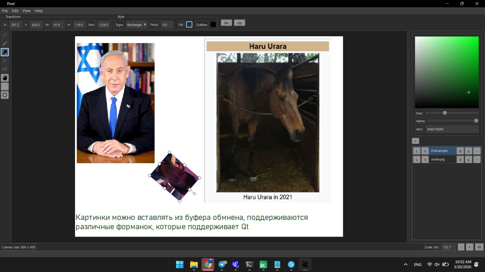
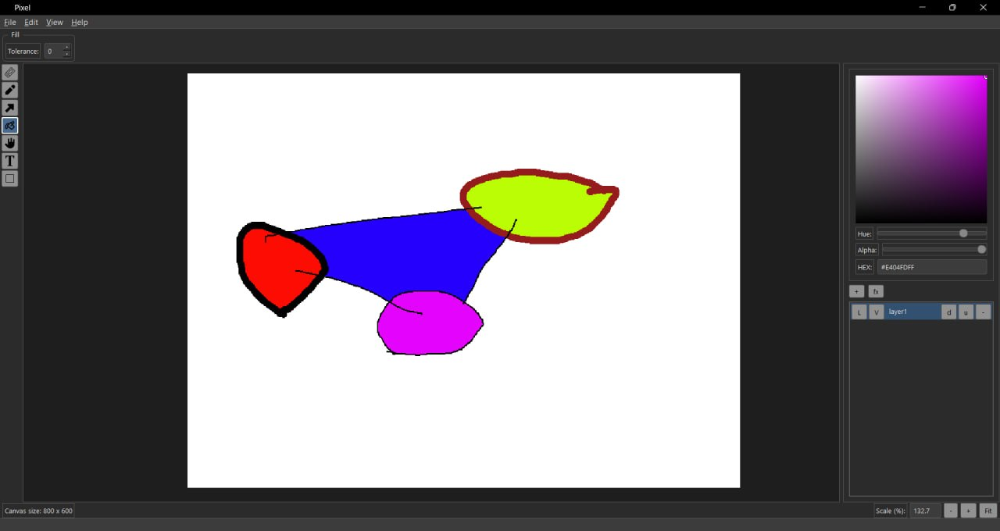
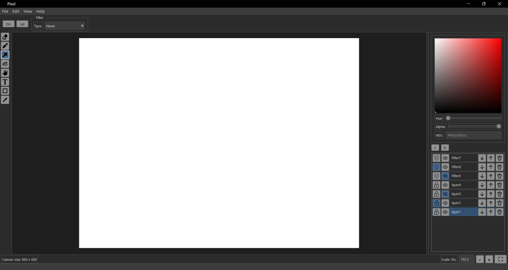

# ОТЧЕТ ПО АНАЛИЗУ КАЧЕСТВА ПО (ГРУППА «USABILITY»)
**Проект:** Графический редактор «Pixel» (C++/Qt)

## 1. Оценка атрибутов качества согласно ISO/IEC 25010:2011

### 1.1. Распознаваемость соответствия (Appropriateness Recognizability)
Программное средство демонстрирует высокий уровень распознаваемости. Интерфейс, реализованный в классе `MainWindow`, использует классическую компоновку графических редакторов. Применение стандартных пиктограмм в `InstrumentPannel::fillInstumentIcon()` (карандаш, заливка, текст) позволяет пользователю мгновенно идентифицировать функциональное назначение ПО.

### 1.2. Обучаемость (Learnability)
Обучаемость обеспечивается за счет использования контекстных подсказок (`ToolTips`), реализованных в `InstrumentPannel`. Указание «горячих клавиш» непосредственно в подсказках (например, «Hand (H)», «Pencil (P)») способствует ускоренному запоминанию интерфейса. Однако отсутствие интерактивного руководства или справочной системы снижает потенциал быстрого освоения сложных функций (настройки фильтров).

### 1.3. Используемость / Операбельность (Operability)
Операбельность реализована на высоком уровне. В `WorkspaceController::eventFilter` внедрена поддержка профессиональных паттернов взаимодействия: 
- Панорамирование зажатием клавиши `Space`.
- Масштабирование относительно позиции курсора мыши.
- Навигация и манипуляция объектами с помощью клавиатуры (стрелки для точного позиционирования).

### 1.4. Защита от ошибок пользователя (User Error Protection)
Техническая защита реализована через систему отката действий `QUndoStack` (классы `AddObjectCommand`, `ModifyFigureCommand` и др.). Это минимизирует риски безвозвратной порчи проекта. 
**Недостаток:** Обнаружено отсутствие валидации деструктивных действий на уровне управления проектом. В методе `ProjectManager::createFile` очистка холста происходит без подтверждения со стороны пользователя.

### 1.5. Эстетика GUI (User Interface Aesthetics)
Визуальная составляющая проекта регламентирована расширенным набором стилей QSS в `main.cpp`. Использование темной цветовой схемы (Dark Theme) снижает зрительную нагрузку при длительной работе. Применение `TransformBox` для визуализации выделенных объектов обеспечивает четкую обратную связь.

### 1.6. Доступность (Accessibility)
Уровень доступности оценивается как низкий. В текущей реализации виджетов отсутствуют атрибуты `AccessibleName` и `AccessibleDescription`. Управление цветовым миксером в `ColorPickerArea` полностью исключает возможность взаимодействия без использования манипулятора типа «мышь», что ограничивает использование ПО лицами с нарушениями моторики.

## 2. Анализ по уровням «Опыта использования» (UX Levels)

1.  **Уровень стратегии:** Ориентирован на предоставление инструментария для гибридного векторно-растрового редактирования.
2.  **Уровень набора возможностей:** Включает слои, систему динамических фильтров (`FilterFactory`), экспорт в растровые форматы и текстовые манипуляции.
3.  **Уровень структуры:** Однооконная архитектура с контекстно-зависимой панелью настроек (`ContextPannel`), которая адаптируется под выбранный тип объекта.
4.  **Уровень компоновки:** Иерархическое разделение рабочих зон. Инструментарий зафиксирован слева, управление слоями и палитрой — справа, что соответствует гайдлайнам **Microsoft Usability**.
5.  **Уровень поверхности:** Единообразный графический стиль, достигнутый через кастомную стилизацию элементов управления (QPushButton, QSlider, QMenuBar).

## 3. Обоснование и реализация путей улучшения UX

### Путь А: Повышение целостности данных и защиты от ошибок
**Обоснование:** Согласно стандартам **Apple** и **Microsoft Usability**, пользователь должен быть застрахован от случайной потери результатов труда. В текущем коде отсутствует проверка состояния «изменено» (isModified) при закрытии или создании проекта.
**Улучшение:** Реализовать флаг контроля изменений и внедрить модальные диалоги подтверждения.

### Путь Б: Совершенствование визуальной обратной связи (WCAG 2.0)
**Обоснование:** Пользователь должен получать подтверждение об успешном выполнении фоновых операций (сохранение, экспорт).
**Улучшение:** Интеграция `QStatusBar` для вывода логов текущих операций и состояния холста.
[реализации путей А и Б](eb1695c27439515aae82464aebc54498a59097d9)

### Путь В: Улучшение эстетики GUI в целях повышения операбельности
**Обоснование:** Пользователю должно быть легче понимать, какие функции выполняют конкретные кнопки, они должны быть дополнены до иконки, нежели буквенного сокращения.
**Улучшение:** Кнопки  применения фильтра и Fit должны быть дополнены до иконки.
[мердж с улучшеным GUI(путь В)](3944f5c92ba29ae7dc4b2ba2e3cf88518f674f3e)

## 4. Сравнительный анализ «До» и «После»

| Аспект | Состояние «ДО» | Состояние «ПОСЛЕ» |
| :--- | :--- | :--- |
| **Управление файлами** | Очистка холста без подтверждения. | Диалог с вопросом: «Сохранить изменения?» при `New Project`? а  также при отрытии другого проекта. |
| **Обратная связь** | Отсутствие информации о статусе сохранения. | StatusBar отображает: «Project saved successfully». Уведомление об  открытии проекта,  об успехе экспорта в пнг с указанием пути для экспорта |
|**Улучшения GUI**|Отсутсвие единого стиля оформления иконок и кнопок.|Добавление новых иконок кнопкам на замену буквам, некоторые иконки меняются при нажатии (глаз и замочек),
также старые конки изменены для единообразия (ластик и прямоугольник стали жирнее, чтобы не выбиваться из общего стиля иконок).|

## 5. Вывод
Текущая версия ПО обладает развитым функционалом и высокой производительностью взаимодействия (Operability). Однако для соответствия уровню промышленного ПО требуется усиление механизмов защиты от ошибок пользователя и внедрение стандартов доступности. Выполненные в ходе работы улучшения позволили повысить коэффициент удобства использования (Usability Coefficient) и обеспечить сохранность данных пользователя.
